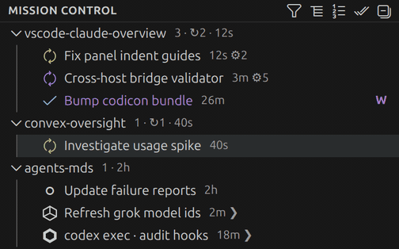
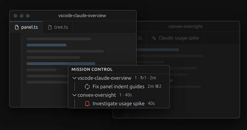
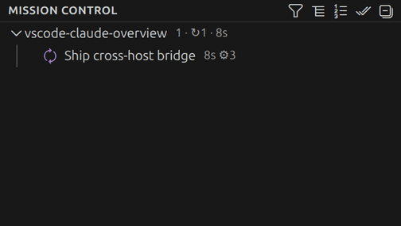
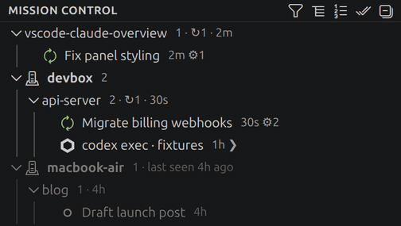

# SessionDeck

One panel for every Claude Code session on this machine — and, through a companion bridge, on every machine you have a VS Code window open to. The extension discovers each running session in every project, watches its status from disk, and shows them all in one tree: in the sidebar, or in a small always-on-top floating window you can park next to your editor.



It exists for people who run many agents at once and lose track of them. The question it answers is: what is every agent doing right now, and which one needs me?

## What's in the tree

Sessions are grouped by project. Each row shows the session's real tab title, its age, and a status icon:

| Icon | Meaning |
|---|---|
| spinning sync, green | working |
| spinning sync, purple | working and orchestrating subagents |
| bell, red | waiting for your approval |
| bell-dot, yellow | finished, result unread |
| check, blue | finished and read |
| circle outline | idle |

Project rows carry counts (`3 · ↻1 · ●1 · 2m`: sessions, working, unread, newest activity). Session rows add glyphs for live subagents (`⚙4`) and terminal-launched sessions (`❯`), and a working row appends a dim "doing now" caption — the current task (`2m · ⚙3 · Migrating schema`) or the tool it's running (`2m · Bash`) — so you can see what it's doing without opening it. A finished-but-unread row mirrors this the other way, appending a dim snippet of its final message (`● Migrated auth to JWT`) so a glance says what it finished, not just that it did (Codex rows get this too, from their last agent message; Cursor exposes no final text, so those stay uncaptioned). If a working row goes silent far longer than its pending tool normally takes — over 5 min for a quick tool like `Read`/`Edit`, over 15 min for a long one like `Bash` — it keeps spinning but gains a dim `· quiet 12m` hint (hover: "may be stalled"), so a wedged session no longer reads as busy for the full window. It never flips the status or raises an alert; it's an observe-only glance. The activity-bar icon badges the number of sessions that need you, so you see it even with the panel closed.

Status is inferred from each session's transcript and process state on disk. That means it covers sessions started anywhere on the host: an IDE tab, a plain terminal, tmux, a cron job. The extension makes no network calls.

## Features

**Automatic discovery.** Scans every Claude Code config home: the default `~/.claude`, `CLAUDE_CONFIG_DIR`, any dirs you add in settings, plus homes auto-detected from running `claude` processes (Linux). Liveness is checked against `/proc` with pid-reuse guards, so dead sessions never linger. With several accounts in play, each session gets a colored one-letter account badge; with one account the tree stays plain.

**Instant updates and approval alerts.** The base refresh is a 3-second poll plus filesystem watches. Run *Install Hooks* once and the extension adds Stop/Notification/UserPromptSubmit hooks to your Claude settings (idempotent, backed up): status flips the moment something happens, and a session blocked on a permission prompt shows a red bell instead of silently stalling. *Mark All as Read* and per-session read tracking keep the unread state honest.

**First-run guidance.** An empty tree tells you what SessionDeck watches and links straight to *Install Hooks* and *Run Diagnostics*. And if hooks are ever off while sessions are running — so a blocked session could stall with no alert — a single dim line at the bottom of the tree says so and links to the fix. It shows at most one such note, only in the unfiltered view, and never counts toward the needs-you badge.

**Same-file collision warning.** When two or more live local sessions have a file edit pending *at the same instant* on the same path — the multi-agent footgun where two agents are about to write the same file and the tree otherwise can't see it — the colliding rows gain a dim `⚠ same file (parent/basename)` marker, their hover names the full path and the other session(s), and one quiet line at the bottom of the tree reads "N sessions editing the same file". It is **observe-only**: no toast, no status change, no badge, nothing is blocked or coordinated — just a heads-up. Detection is deliberately narrow: only *pending-now* edits count (never a file's edit history), only the four edit tools (Edit, Write, MultiEdit, NotebookEdit) contribute a path, and known machine-written shared files (lockfiles like `bun.lock`/`package-lock.json`, anything under `.git/`) are ignored so the rare real signal isn't buried. Local sessions only; the cross-host snapshot is untouched.

This is the one place the extension reads a tool's **input** rather than only its name. To match two sessions on the same file it must know the *path* each is editing, so — scoped to those four edit tools — it reads the single path field (`file_path`, or `notebook_path` for notebooks) and **nothing else**: never `old_string`/`new_string`/`content`/the edits array or any other input key, and never Bash command text (a shell command has no reliable structured path, so Bash stays entirely out of scope). Paths are local-session data the tree already shows (cwds, titles); in the *Copy Debug Report* blob any such path rides the same absolute-path collapse as everything else (`<path>/<basename>`).

**Click to navigate.** Clicking a session jumps to it: reveals its Claude tab (even in another window, via a cross-window relay), or focuses the integrated terminal it runs in. When there's nothing to focus, you get a rendered preview of the session's last message instead — also available any time via *Show Last Message*.



**Activity tree.** Toggle it on and sessions expand to show what's running underneath: workflows with their per-agent progress, subagents, and the task list, each with live state. Clicking a workflow or agent opens its journal or transcript.



**Cursor Agent and Codex sessions.** Running `cursor-agent`, `codex`, or `codex exec` sessions appear under their projects alongside Claude sessions, with their own brand icons and working/idle state. They also carry **finished-unread**, so a Cursor or Codex run that just stopped producing output shows a `●` marker and counts toward the same unread badge, chip and *Mark All as Read* as Claude sessions — clicking the row clears it. For Codex this is read straight from the rollout: a session whose last turn boundary is `task_complete` (it finished and produced a final message) is treated as finished, while an open turn stays working. For Cursor it comes from the same idle/activity signal the row already uses (its per-turn "awaiting you" state isn't exposed on disk in a documented way, so nothing is guessed). Neither tool exposes an approval/permission-prompt state on disk, so — unlike Claude — Cursor and Codex rows never claim to be "waiting for your approval" and never raise a toast; anything ambiguous stays plain working/idle. Both are on by default and can be switched off.

### Cursor Composer monitoring

SessionDeck can show live Cursor GUI Composer and agent sessions through `~/.cursor` hooks, grouped by project. Agent mode moves from working to finished; ask mode shows recent activity only. Run **SessionDeck: Enable Cursor Monitoring** to add a marker-tagged nine-event section to `~/.cursor/hooks.json` and install its probe script. **SessionDeck: Disable Cursor Monitoring** removes both. The `sessionDeck.showCursorComposer` setting controls whether these rows are shown.

Cursor exposes no approval or “needs you” hook for Composer. Composer rows therefore never alert, toast, or count in the badge. Hooks provide live status only; names, todos, and history enumeration are planned for a later phase.

Disable monitoring before uninstalling the extension. Otherwise Cursor keeps launching the probe on each event; after its seven-day lease expires the probe becomes a no-op and writes nothing. Without the extension, remove the probe with `rm -f ~/.local/state/claude-overview/cursor-hook.sh`, then manually delete the entries containing the SessionDeck marker from `~/.cursor/hooks.json`.

For a clean uninstall, run **SessionDeck: Remove All Integrations**. It removes both the Claude hooks and Cursor monitoring. You can instead run **SessionDeck: Remove Hooks** and **SessionDeck: Disable Cursor Monitoring** separately before uninstalling.

**Cross-host view.** Every VS Code remote window (WSL, Remote-SSH, containers — anything VS Code can open) publishes its host's sessions to your local machine over VS Code's own cross-extension-host command channel. Remote hosts appear as read-only sections in the same tree: live while a window is open, honestly dimmed ("last seen 4h ago") after it closes, pruned after 14 days. No sockets, no daemons, no credentials; snapshots carry titles, status and an optional last-message preview, stay on your local disk, and are validated as untrusted input. Clicking a **live** remote session focuses that session's window/tab on its own host (whenever a window to that host is open on this machine — the same condition that makes the row "live"); a stale row instead shows its last message, still available on live rows via *Show Last Message* in the right-click menu.



This needs the small companion extension in bridge/ — no UI, no network I/O. Install its vsix once on your local (desktop) side; it loads on the local end of every window, aggregates what each remote's main extension publishes, and serves real tab titles back to remote windows (via its `sessionDeckBridge.titles` command) since only the local editor can read its own workspace storage. Each remote host you want to see needs SessionDeck installed in that remote (VS Code offers to do this automatically).

**Alerts.** So you never miss a needs-you moment even with the panel closed. The moment a local session blocks — on a permission prompt or on a pending question/plan (including live remote hosts, whose blocked sessions toast "&lt;session&gt; on &lt;host&gt;: needs you") — you get a VS Code notification with an **Open** button that jumps straight to it, exactly like clicking the row. The toast (and the row and its hover) name **what** is being asked — the permission reason (e.g. "needs your permission to use Bash") or the question text — so you can often act without opening the session. One toast per incident: a session that stays blocked never nags, and one that unblocks and re-blocks later toasts again. When a parallel fleet piles up — **three or more incidents from distinct sessions within 45 seconds** — the per-incident toasts collapse into a single **"N sessions just blocked"** summary (scoped to what just blocked, since the chip owns the running total; tagged with the shared permission class when they all block on the same one, e.g. "needs your permission to use Bash") whose **Triage** button walks the urgency-ranked needs-you set; the burst ends after 60 seconds with no new block, and individual toasts resume. A status-bar chip (`$(bell) N`, warning-colored) mirrors the activity-bar badge — the count of sessions needing you — and clicking it opens SessionDeck filtered to just those. The chip is passive and always honest; `sessionDeck.notifications: off` silences the toasts without touching it. Toasts fire only for Claude's blocked states (approval/question) — Cursor and Codex don't expose an equivalent "waiting for you" signal on disk, so they contribute their finished-unread count to the chip and badge but never toast. Notifications are VS Code-level, so they show in-window — and an in-window toast is exactly what gets missed when the VS Code window is unfocused. Two **opt-in escalation channels** (both **off by default**) break out of the window for precisely that case: `sessionDeck.unfocusedSound` plays a short sound, and `sessionDeck.unfocusedOsNotification` posts a real OS notification (VS Code's own toasts never reach the OS notification centre, so this isn't redundant). They ride the exact same incidents as the toasts — approval prompts and pending questions, local and live-remote — fire **only while the window is unfocused** (a focused window keeps the toast-only path, and the focus-return digest already covers what arose while away), and are rate-limited to **one delivery per 30 seconds** so a burst of blocked sessions escalates once. No session title or reason is ever passed to the spawned command — only a generic title and a session count — because a command's arguments leak into process lists.

**Per-platform support is honest, not aspirational** (spawning a player/notifier is the only path — VS Code has no audio or OS-notification API):

| Channel | Linux (desktop) | WSL | Windows (native) | macOS |
|---|---|---|---|---|
| `unfocusedSound` | `paplay` / `pw-play` (bundled ping) | `paplay` / `pw-play` where present (WSLg), else `powershell.exe` system sound | `powershell.exe` system sound | `afplay` (bundled ping) |
| `unfocusedOsNotification` | `notify-send` | `notify-send` where present (WSLg), else none | — no dependable zero-setup toast | `osascript` |

Where no command is available the channel is a silent no-op; *Run Diagnostics* reports exactly which channel can and can't deliver on your machine — trust it over this table, since it probes the tools actually on your PATH. WSL runs as Linux, so the extension uses whatever Linux tools are installed there: a WSLg box with `notify-send`/`paplay` gets real toasts and the bundled wav, exactly like desktop Linux; a headless WSL box falls back to the `powershell.exe` sound and has no toast. On native Windows an OS toast needs an extra module (BurntToast) or a registered app id, neither dependable out of the box — so that channel isn't shipped there, and the sound channel covers it instead. Because a toast can also fire and get buried while the window is unfocused, coming back to focus after 10+ minutes away shows one **focus-return digest** — "While you were away: N session(s) need you" with a **Triage** button — counting only the sessions that came to need you during the absence (nothing new, or you never really left, and it stays silent). **Keyboard triage:** `ctrl+alt+]` (`cmd+alt+]` on macOS) jumps to the next session needing you and `ctrl+alt+[` to the previous — each opens the session exactly like a click and reveals its row, so you can clear the whole needs-you set without touching the mouse (wrapping around; nothing needs you → a brief status-bar note). The walk (and the focus-return digest) is urgency-ranked, not geographic: local approvals and pending questions first, then finished-unread sessions, then live-remote rows — and oldest-blocked first within each — so a long-waiting red is never stuck behind a just-arrived yellow. Rebind via *Preferences: Open Keyboard Shortcuts* → search **Next Session Needing You** / **Previous Session Needing You** (also runnable from the command palette).

**Floating always-on-top window.** *Open as Floating Window* detaches the panel into its own pinned OS window that mirrors the tree exactly, click behavior included. Useful on a second monitor while agents grind.

**Filter and sort.** Filter to the last hour, last day, or only sessions needing attention; sort by activity, name, or **heat** — heat orders projects by row-status pressure, floating the ones that most want you to the top: blocked-on-you rows (a permission prompt or a pending question) outweigh finished-unread, which outweigh working, with a small recency tiebreak from each project's newest activity. Because it scores by *status* — a question you've already seen but not answered is still blocking — heat can rank a project differently from the needs-you badge, which counts only unseen items. Collapse or expand everything at once.

**Compact view.** When 30 agents across a dozen projects turn the fully-expanded tree into a wall, the toolbar's *Toggle Compact View* (or `sessionDeck.density: compact`) folds every project down to a one-line header carrying its pressure at a glance — `🔔` needs-you first, then the total, working (`↻`) and unread (`●`) counts, and the newest age — with the session rows tucked away until you open a project. The one thing it never buries: any project with a session blocked on you (a permission prompt or a pending question) **auto-expands**, so "which one needs me" is always in view. It's presentation only — the same rows, the same counts — and it applies to remote host sections and the floating panel alike.

**Pin and hide.** Two ways to tame a big tree. **Pin Project** (right-click a project) floats it above every sort mode — pinned projects keep the active sort among themselves and carry a small `📌`; pins persist and prune themselves once a project has been gone for a week. **Hide Session** (right-click any local Claude, Cursor or Codex row) makes a session disappear from the tree, the panel, the needs-you badge, the chip, alerts and triage all at once — it's noise you've chosen to silence, so it stops counting everywhere. A hidden session **auto-unhides the moment it produces new activity** (its transcript advances past the instant you hid it), because a session that wakes back up matters again. Nothing is ever silently lost **on this machine**: a dim `N hidden` line sits at the bottom of the unfiltered tree, and *Show Hidden Sessions* opens a picker of every hidden row (title + how long it's been hidden) to unhide one or all. You can only hide *your own* sessions, not another host's remote rows. But note the reach: because a hidden session stops counting *everywhere*, it is also dropped from the snapshot this machine publishes to your other hosts over the cross-host bridge — so on a peer window this host's hidden session simply isn't listed under it (the peer gets no `N hidden` note and can't unhide it; that restore lives only where you hid it). This is deliberate — hiding is per-person noise control that follows you across your own fleet, not a local-only view toggle.

**Setup Doctor.** *SessionDeck: Run Diagnostics* opens a read-only report — one line per subsystem — that tells you whether everything is wired up and, when it isn't, the exact command or setting to fix it. It probes the real subsystems (config homes and their live-session counts, hooks, the cross-host bridge companion, host identity, tab-title extraction, the SQLite engine, `/proc` introspection, the editor CLI on your PATH, notifications, and the opt-in unfocused sound / OS-notification channels and whether they can deliver on this platform), orders the findings problem-first, and never changes anything. Run it whenever the tree looks emptier than expected.

**Debug report.** *SessionDeck: Copy Debug Report* assembles one markdown blob — environment, versions, the full Diagnostics output, the format-canary state, the boolean/enum values of your `sessionDeck.*` settings, and session/host counts — copies it to the clipboard and opens it read-only. It is auto-scrubbed for public paste: every absolute path is collapsed to `<path>/<basename>`, config-home and host labels become `<home-N>`/`<host-N>` tokens, and your username becomes `<user>`; random per-machine host ids (`h_…`, not derived from your name or hostname) are kept for correlation, and no cwds, tab titles, message text or prompt text are ever included. Attach it to a bug report as-is.

## Requirements

- Linux or WSL is the primary target. `/proc` powers liveness, config-home detection and terminal matching; on macOS/Windows those degrade and discovery is limited to configured homes.
- Everything else is optional and degrades silently when absent: an SQLite reader for real session titles and Cursor names (Node's built-in `node:sqlite` when the editor ships it, else `python3`), your editor's CLI (cross-window focus — `code`, `code-insiders`, `codium`, `cursor` or `windsurf`, auto-detected from the running editor), the Claude Code extension (tab navigation).
- VS Code or Cursor ≥ 1.85. Zero runtime dependencies — the extension ships nothing but its own compiled output.

## Install

```sh
bun install
bun run build
bun run package        # produces dist-vsix/sessiondeck-<version>.vsix
```

Install the `.vsix` via "Extensions: Install from VSIX". For the cross-host view, do the same in `bridge/` and install that vsix on your local side.

**From the Marketplace (once published).** Because the main extension declares `extensionKind: ["workspace"]` and the bridge declares `["ui"]`, a Marketplace install does the right thing automatically: installing SessionDeck installs the `ui` bridge on your local desktop, and **opening any remote window (WSL, Remote-SSH, container) auto-installs the workspace extension into that remote** — VS Code's standard behavior for workspace-kind extensions. So the only manual step for the cross-host view is having SessionDeck available locally; each remote is provisioned on first open. (Publishing is owner-gated; until then the manual VSIX install above is the default.)

**One codebase, two extension IDs.** SessionDeck ships as two cooperating extensions built from one repository: the main extension (`sessiondeck`, runs on the workspace/remote side) and the invisible bridge companion (`sessiondeck-bridge`, runs on the local desktop side). Two IDs are unavoidable — VS Code runs one extension ID in exactly one extension host per window, and the cross-host command bridge needs a local (`ui`) peer to the remote (`workspace`) main. **Single version:** `bridge/package.json`'s version is *derived* from the root `package.json` at build time (they can't diverge; CI asserts the derivation ran), and the shared schema/SQLite/title-reader source is imported and bundled into the companion — not copied — so a release always produces a matched, single-source pair.

**Releases.** Pushing a tag `vX.Y.Z` (matching the `package.json` version) runs `.github/workflows/release.yml`: it builds both extensions, verifies the tag equals the version (and that the bridge version was derived), and publishes a GitHub Release with both vsix files attached and generated notes. Marketplace / Open VSX publishing is wired but **off until the owner opts in** — the publish steps skip silently unless two repo secrets exist:

| Secret | Enables |
|---|---|
| `VSCE_PAT` | `vsce publish` to the Visual Studio Marketplace (both extensions) |
| `OVSX_PAT` | `ovsx publish` to Open VSX (both extensions) |

Add either secret to turn on that registry; leave both unset to keep releases GitHub-only. (Marketplace PAT auth is changing — Microsoft is moving `vsce` toward Entra / azure-credential auth around Dec 2026 — so prefer the azure-credential path over a long-lived PAT when enabling real publishing.)

## Settings

| Setting | Default | What it does |
|---|---|---|
| `sessionDeck.enableNavigation` | `true` | Click focuses the session; off = always show last message |
| `sessionDeck.activityTree` | `false` | Expandable workflows/subagents/tasks under sessions |
| `sessionDeck.density` | `"comfortable"` | `compact` collapses project rows by default (auto-expanding any that need you) and folds a pressure summary into each header |
| `sessionDeck.notifications` | `"urgent"` | Toast when a session needs you (approval/question); `off` silences toasts (chip stays) |
| `sessionDeck.unfocusedSound` | `false` | Play a short sound when a session needs you **while the window is unfocused** (rate-limited to 1/30s). Support: paplay/pw-play (Linux, incl. WSLg where installed), powershell system sound (native Windows / headless WSL), afplay (macOS) |
| `sessionDeck.unfocusedOsNotification` | `false` | Post a real OS notification when a session needs you **while the window is unfocused** (rate-limited to 1/30s). Support: notify-send (Linux, incl. WSLg where it's installed), osascript (macOS); no dependable toast on native Windows or a headless WSL box |
| `sessionDeck.showCursorAgents` | `true` | Show Cursor Agent CLI sessions |
| `sessionDeck.showCursorComposer` | `true` | Show Cursor GUI Composer sessions observed through Cursor hooks |
| `sessionDeck.showCodexAgents` | `true` | Show Codex CLI sessions |
| `sessionDeck.crossHost` | `true` | Publish/merge cross-host snapshots via the bridge |
| `sessionDeck.publishLastText` | `true` | Include last-message previews in published snapshots |
| `sessionDeck.floatAlwaysOnTop` | `true` | Pin the floating window on top |
| `sessionDeck.extraConfigDirs` | `[]` | Extra Claude config homes to scan |
| `sessionDeck.editorCliPath` | `""` | Editor CLI used to focus other windows; auto-detected from the running editor when empty |
| `sessionDeck.cursorCliPath` | `""` | Deprecated — use `editorCliPath` |

## Honest limitations

Status is inferred from transcript tails and mtimes. The turn boundary comes from each assistant record's `stop_reason` (`end_turn` ⇒ done, `null` ⇒ mid-generation), so a session narrating between tool calls no longer briefly reads "done", and an interrupted turn (you hit Esc) settles to idle at once — its `[Request interrupted by user]` marker is read straight off the tail — instead of lingering on "working". A working row that goes silent far past what its pending tool normally takes (per-class thresholds measured from 84k real tool completions) gains a dim "quiet Xm" hint so a wedged tool doesn't read as busy for the whole window — observe-only, never a reclassification. The residual soft spot is still the fixed age windows a stalled tool eventually crosses (a turn killed so hard no marker was written just drops off with its dead process). Real titles come from the editor's own workspace storage — read directly for local windows, and served by the bridge companion's `sessionDeckBridge.titles` command for sessions in remote windows; without either you get `project-hash` fallbacks. Cross-host focus is the one action that crosses hosts (clicking a live remote row); everything else stays read-only, and because each editor keeps its own workspace store, Cursor and VS Code aggregate independently — separate bridge stores and separate titles. Hooks only affect sessions started after installation. Every format read here (Claude transcripts, Codex rollouts, Cursor's `store.db`, the editor's title storage) is private and undocumented, so a vendor release can move it out from under the parser — when that happens rows go empty or fall back silently, so a built-in format canary watches for it: Diagnostics carries a line per surface (and a dim "Format drift suspected" note appears) once a surface's files stop parsing, while a version merely newer than the last known-good one is only noted, not alarmed. When a surface has drifted, that Diagnostics line's fix-hint (and the *SessionDeck: Capture Drift Fixture* command) turns the alarm into a head start on the fix: it takes a small slice of each affected file, anonymizes it with the same rules the committed test fixtures follow (paths → `/home/user/project`, ids → tokens, all free text → placeholders), refuses any slice that still trips the fixtures' username/home-path guard, and writes the clean slices to a scratch folder under the extension's storage (never the repo) with a summary of where to file them.

## Maintenance & contracts

This is a solo-maintained, observe-only tool. It reads private, undocumented formats (Claude transcripts, Codex rollouts, Cursor's `store.db`) and supports the latest stable version of each; when a vendor moves a format, the built-in format canary flags it and SessionDeck follows the new version. Linux and WSL are first-class; macOS and Windows are best-effort. Patch releases fix drift and bugs; a minor release means documented behavior changed.

## License

Source-available, not open source — see [LICENSE](LICENSE) for the plain-English
terms, including the free tier and how license keys work.
You can read the source and modify it for your own use; it isn't free for unlimited
commercial use.

**What's free.** Everything works with no limits for a **3-day evaluation** from first
run. After that, light use stays free forever: **up to 3 sessions** (top-level sessions —
subagents and workflow children never count; remote hosts don't count toward the
limit).

**What a license covers.** Your 3 covered sessions — active ones taking the slots
first — always render in full: status, children, alerts, click-to-navigate. Sessions
beyond the cap collapse to a locked **"Not available in free version"** placeholder
row (no title, no details, no alerts) until you hold a license. Nothing on your disk
is touched — the cap only limits what the tree displays. A license lifts the cap for
your **whole fleet** — **monthly ($5.99/month) or lifetime ($18.99 once), per
person, not per machine**, with a 7-day money-back guarantee on lifetime. No
resale, no de-paywalled forks, no shared keys. The bridge companion stays
**MIT-licensed**, so the desktop-side relay installs friction-free everywhere.

**Offline by design — a feature, not a footnote.** License validation is a **local
check on an offline key** — no phone-home, no telemetry, no network call anywhere in
licensing. The extension makes no network calls, so it can run **fully offline** and
still know exactly what your license allows. Because the key lives in the
`sessionDeck.licenseKey` setting, leaving **Settings Sync** on carries your
per-person license across your own machines automatically.

**Entering a license.** Run **SessionDeck: Enter License Key** (the key is
validated live as you type) or paste it into `sessionDeck.licenseKey`; **Buy
License** opens the purchase page. When you're over the cap, a `$(key) Free tier`
status-bar item and a quiet note at the bottom of the tree offer the same options.
